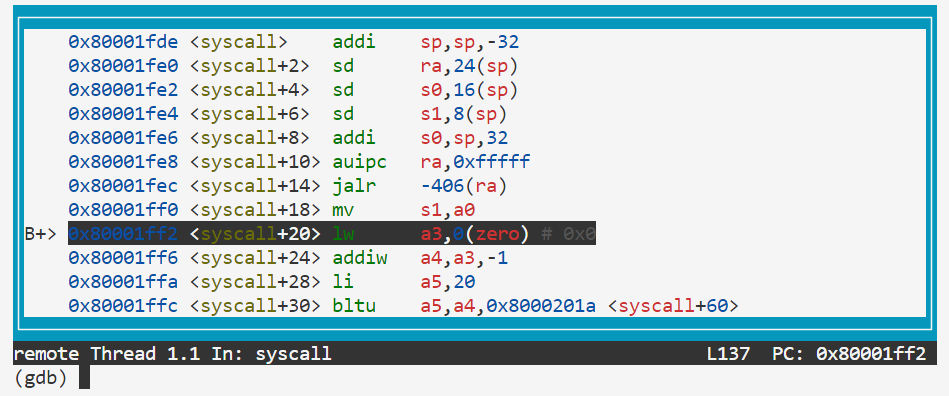

# 初始化流程简介

RISC-V virt QEMU 启动时处于 M 态，默认的 pc 在 `0x80000000`，查看 `kernel/kernel.ld` 可以看到那里放的是 `_entry`，随后是其余代码。

`_entry` 位于 `kernel/entry.S` 中，在简单设置栈后会跳转到 `kernel/start.c` 的 `start()` 中。这里面做了一些寄存器的设置，通过模拟中断返回来退回 S 态。此外还做了设置了终端委托到 S 态、请求时钟中断、配置物理内存保护、将 CPU 的 `hartid` 存入 `tp` 寄存器等操作。上面这部分相当于做了 SBI 应该做的操作，至于为啥 xv6 没用 SBI，我也不知道，不过不用 SBI 代码量也不大。

从 M 态返回后进入 S 态，pc 指向 `kernel/main.c` 中的 `main()` 函数。随后使用 CPU0 做一系列初始化过程，包括 UART 串口初始化、printf 初始化、物理内存管理数组初始化、虚存管理初始化、打开分页、进程管理初始化（初始化进程 PCB 数组）、设置中断向量、设置 PLIC 外部中断控制器、初始化缓冲区、inode 表、文件表、virtio 虚拟硬盘，并在最后启动第一个用户进程。在 CPU0 操作结束后剩余的 CPU 做虚存初始化、中断初始化和 PLIC 外部中断控制器初始化。随后所有 CPU 开始调度进程。

上面那些只有 CPU0 干的活都是用于设置一些内存中的数据结构和锁的，UART、PLIC、virtio 虚拟硬盘初始化设置了这些硬件的寄存器，这些部分都不涉及与 CPU 相关的寄存器，也就是说只要一个 CPU 设置一遍，其他 CPU 也能使用这些设置完的东西，因此只需要 CPU0 做就可以了。只有开启页表、配置中断向量是要配置 CPU 的寄存器的，一部分的 PLIC 寄存器设置是和 CPU 相关的，所以这些需要每个 CPU 都执行一遍。

因为这个实验有涉及，我们先关注一下中断（trap）初始化与虚存初始化相关的内容。

## 内核态虚存

进入 `kernel/vm.c` 中可以看出内核有一个自己的页表在全局变量 `pagetable_t kernel_pagetable` 中，`kvmmake()` 就是对这个页表做初始化：

- 做了 UART 寄存器区、virtio 寄存器区、PLIC 寄存器区、内核代码区和数据区的直接映射（所谓直接映射也就是虚拟地址映射到相同的物理地址上，换句话说虚地址与物理地址相同）
- 将 trampoline 区映射到 `kernel/trampoline.S` 中 `trampoline` 符号所在地。
  - 根据 `#define TRAMPOLINE (MAXVA - PGSIZE)` 定义，trampoline 区是虚地址最高的一页。
  - 根据 `kernel/kernel.ld`，`trampoline` 符号位于所有代码的末尾向上对齐到 `0x1000` 处，并且大小不超过一页。
  - 内容是 `kernel/trampoline.S` 中 `trampoline` 符号之后所有内容，包括 `uservec` 和 `userret`。
- 为所有用户态进程创建了内核栈（用于中断进入内核态后使用）。
  - 每个用户态进程的内核栈地址根据 `#define KSTACK(p) (TRAMPOLINE - ((p)+1)* 2*PGSIZE)` 计算得到，也就是在 trampoline 区下方。
  - 从进程 0 依次往下，每个进程分得两页（公式中的乘 2），并且只映射低地址的那一页为可读可写且有效。这样当栈增长溢出一个页面的大小的时候，没有被映射的那一页就会因为 V 位为 0 导致异常，避免栈溢出破坏其他进程的内核栈区，未映射的那一页成为了保护页。

至于你问我 trampoline 是啥意思，我也不知道（摊手），也许就是字面意思吧。

以上是内核态的页表的初始化，之后 `kvminithart()` 函数通过写入 `satp` 寄存器启用该页表，开启虚存。

## 内核态中断

中断设置函数为 `trapinithart()`，将 `kernelvec` 写入 `stvec` 寄存器，说明 `kernelvec` （在 `kernel/kernelvec.S` 中）就是一个中断处理函数。它在保存完寄存器后调用了 `kerneltrap()` 函数（在 `kernel/trap.c` 中）。

## 1 号进程的初始化准备

用户态的东西都是在初始化第一个进程的时候才被设置的，主函数就是 `userinit()`。

首先调用 `allocproc()`，查找 PCB 数组中空闲的一项，分配 pid，设置状态为 `USED`，随后分配了一页物理页，填入 PCB 中的 `trapframe` 指针，作为存放中断帧的页。

随后使用 `proc_pagetable()` 分配一个用户区为空的用户态页表。但是在这个页表中，`trampoline` 区和中断帧的区是已经被映射好的：

- `trampoline` 区的映射和内核态的虚存映射一致，非 U 态可读可执行有效（中断的时候 S 态可访问就行了）。
- 中断帧页面位于虚存中 `trampoline` 页面往下（低）一页，映射到 PCB 中 `trapframe` 指针所指的地址，非 U 态可读可写有效。这一页的再往下就正好是 0 号进程的内核栈了。

之后构建该进程的上下文：

1. 清空 PCB 中的 `context` 结构体
2. 设置 `ra`（存放返回地址的寄存器）的值为 `forkret`
3. 设置 `sp`（存放栈的地址的寄存器）的值为 `p->kstack + PGSIZE`，也就是内核栈再往上（高）的一页（注意这是用户页表，这个虚拟地址对 1 号进程来说似乎还是中断帧页面）。

随后将 `initcode` 加载到虚存的 0 地址处（第 0 页），设置该页权限为 U 态可读可写可执行。`initcode` 是直接以二进制指令的形式事先存在全局变量中的，源码可以参考 `user/initcode.S`。

接下来是 PCB 的剩余的设置：

- `sz`（已用内存，字节）为 `PGSIZE`
- `trapframe->epc`（发生中断时的地址，用于模拟中断）为 0
- `trapframe->sp` 为 `PGSIZE`（即第一页起始地址）
- `name` 为 "initcode"
- `cwd` 为 "/"
- `state` 为 `RUNNABLE`

最后在 `main()` 函数中运行 `scheduler()` 调度进程，找到合适的进程后使用 `swtch`（位于 `kernel/swtch.S`）切换过去，它会保存当前 CPU 的上下文到 `struct cpu -> context` 中，并加载新进程的上下文，并返回（到 `ra` 寄存器所指的地址）。

上文中提到上下文中的 `ra` 寄存器已经被设置为 `forkret()` 的地址，因此返回后会进入该函数。它会调用 `fsinit(ROOTDEV)` 初始化文件系统，再调用 `usertrapret()`完成后续操作。

`usertrapret()` 这个函数一看就是从用户态发生的中断返回时运行的函数，它：

- 重新设置了 `stvec` 寄存器，将中断处理函数设成了 `trampoline.S` 中的 `uservec`
- 重新设置了当前进程的中断帧 `p->trapframe` 中的一些值，用于下次从用户态发生中断的时候使用：
  - `kernel_satp` 设置为当前（S 态的）`satp`
  - `kernel_sp` 设置为 `p->kstack + PGSIZE`（即内核栈）
  - `kernel_trap` 设置为 `usertrap`
  - `kernel_hartid` 设置为当前 `tp` 寄存器的值（CPU 的 hardid）
- 设置一些用来从 S 态返回 U 态的寄存器的值
  - 设置 `sstatus` 的 `SPP` 位为 0（表示是从 U 态进入中断的，返回时也会返回到 U 态）
  - 设置 `sstatus` 的 `SPIE` 位为 1（表示进入中断前中断是启用的，返回后中断要重新启用）
  - 设置 `sepc` 为中断帧中保存的 `epc`，用于回到从用户态发生中断时的位置
- 准备用户态进程的页表所对应的 `satp` 寄存器的值
- 调用 `userret(satp)`，从中断返回，通过 `a0` 寄存器传参，切换到上述准备好的 `satp` 寄存器的值，恢复发生中断时的上下文，恢复到 U 态。

做完上述步骤，1 号进程算是完全配置完毕了，设置完了用户态进程使用的页表和 `satp` 寄存器。当 1 号进程回到用户态时就会跳转到 `sepc` 所指向的地址 `0x0`，那里放的就是 `initcode` 的代码，内容就是执行 `exec` 系统调用，参数为 `exec(init, argv)`，也就是执行了 `user/init.c` 的 `main()` 函数，之后一切就走上了正轨。

## U 态发生中断的过程

上述 `usertrapret()` 只是中断处理完成后的后半段，根据上述描述，在恢复到 U 态时，`stvec` 设置为了 `uservec`。

看一下 `uservec`，会发现它将所有通用寄存器存入了 `p->trapframe`，使用 `p->trapframe->kernel_sp`、`p->trapframe->kernel_hartid` 分别替换了 `sp`、`tp` 寄存器，用 `p->trapframe->kernel_satp` 设置了 S 态的页表，并跳转到了 `p->trapframe->kernel_trap`，很显然和上面 `usertrapret()` 中的操作是一一对应的。

`kernel_trap` 设置为 `usertrap`，因此就是跳转到了 `usertrap()` 继续完成中断处理过程。

`usertrap()` 执行过程如下：

- 设置 `stvec` 寄存器为 `kernelvec()` 函数（定义于 `kernelvec.S`）的地址，用于之后开中断后在 S 态发生嵌套中断的时候使用
- 设置 `p->trapframe->epc` 为当前 `sepc` 寄存器的值
- 如果 `scause` 寄存器值为 8（表明是 U 态 `ecall` 导致的中断）
  - 如果当前进程被 kill 了，返回（重新调度）
  - 设置 `p->trapframe->epc` 加 4，用于返回时跳过 `ecall` 指令
  - 开中断
  - 调用 `syscall()` 处理系统调用
- 否则用 `devintr()` 检查并处理是否是外部中断或者软件中断
- 否则报错，杀死进程
- 如果进程被杀死，就退出并重新调度下一进程
- 如果是时钟中断导致的，就通过 `yield()` 让该进程放弃 CPU，重新调度下一进程
- 调用 `usertrapret()`，从中断返回，回到上文

# Using gdb

> In many cases, print statements will be sufficient to debug your kernel, but sometimes being able to single step through some assembly code or inspecting the variables on the stack is helpful.
> 
> To learn more about how to run GDB and the common issues that can arise when using GDB, check out [this page](https://pdos.csail.mit.edu/6.828/2022/labs/gdb.html).
> 
> To help you become familiar with gdb, run `make qemu-gdb` and then fire up gdb in another window (see the gdb bullet on the [guidance page](https://pdos.csail.mit.edu/6.828/2022/labs/guidance.html)). Once you have two windows open, type in the gdb window:
> 
> ```
> (gdb) b syscall
> Breakpoint 1 at 0x80002142: file kernel/syscall.c, line 243.
> (gdb) c
> Continuing.
> [Switching to Thread 1.2]
> 
> Thread 2 hit Breakpoint 1, syscall () at kernel/syscall.c:243
> 243     {
> (gdb) layout src
> (gdb) backtrace
> ```
> 
> The `layout` command splits the window in two, showing where gdb is in the source code. The backtrace prints out the stack backtrace. See [Using the GNU Debugger](https://pdos.csail.mit.edu/6.828/2019/lec/gdb_slides.pdf) for helpful GDB commands.
> 
> Answer the following questions (store the answers in answers-syscall.txt):
> 
>> Looking at the backtrace output, which function called syscall?

实际上可以使用 `make qemu-gdb` 与 `gdb-multiarch -x .gdbinit` 配合启动就可以调试了。这个 `.gdbinit` 应该是 git 仓库里自带的，但是文档里都没有提到。

```
(gdb) b syscall
Breakpoint 1 at 0x80001fde: file kernel/syscall.c, line 133.
(gdb) c
Continuing.
[Switching to Thread 1.3]

Thread 3 hit Breakpoint 1, syscall () at kernel/syscall.c:133
133     {
(gdb) bt
#0  syscall () at kernel/syscall.c:133
#1  0x0000000080001d12 in usertrap () at kernel/trap.c:67
#2  0x0505050505050505 in ?? ()
```

> Type `n` a few times to step pass `struct proc *p = myproc();` Once past this statement, type `p /x *p`, which prints the current process's proc struct (see `kernel/proc.h`) in hex.
> 
>> What is the value of `p->trapframe->a7` and what does that value represent? (Hint: look `user/initcode.S`, the first user program xv6 starts.) 

```
(gdb) n
135       struct proc *p = myproc();
(gdb) 
137       num = p->trapframe->a7;
(gdb) p /x *p
$1 = {lock = {locked = 0x0, name = 0x80008178, cpu = 0x0}, state = 0x4, chan = 0x0, killed = 0x0, xstate = 0x0, pid = 0x1, parent = 0x0, kstack = 0x3fffffd000, sz = 0x1000, pagetable = 0x87f73000, trapframe = 0x87f74000, context = {ra = 0x80001464, sp = 0x3fffffde70, s0 = 0x3fffffdea0, s1 = 0x80008d10, s2 = 0x800088e0, s3 = 0x1, s4 = 0x3fffffded0, s5 = 0x8000eb98, s6 = 0x3, s7 = 0x800199b0, s8 = 0x1, s9 = 0x80019ad8, s10 = 0x4, s11 = 0x0}, ofile = {0x0 <repeats 16 times>}, cwd = 0x80016e20, name = {0x69, 0x6e, 0x69, 0x74, 0x63, 0x6f, 0x64, 0x65, 0x0, 0x0, 0x0, 0x0, 0x0, 0x0, 0x0, 0x0}}
(gdb) p /x (struct trapframe)*0x87f74000
$5 = {kernel_satp = 0x8000000000087fff, kernel_sp = 0x3fffffe000, 
  kernel_trap = 0x80001c84, epc = 0x18, kernel_hartid = 0x2, 
  ra = 0x505050505050505, sp = 0x1000, gp = 0x505050505050505, 
  tp = 0x505050505050505, t0 = 0x505050505050505, t1 = 0x505050505050505, 
  t2 = 0x505050505050505, s0 = 0x505050505050505, s1 = 0x505050505050505, 
  a0 = 0x24, a1 = 0x2b, a2 = 0x505050505050505, a3 = 0x505050505050505, 
  a4 = 0x505050505050505, a5 = 0x505050505050505, a6 = 0x505050505050505, 
  a7 = 0x7, s2 = 0x505050505050505, s3 = 0x505050505050505, 
  s4 = 0x505050505050505, s5 = 0x505050505050505, s6 = 0x505050505050505, 
  s7 = 0x505050505050505, s8 = 0x505050505050505, s9 = 0x505050505050505, 
  s10 = 0x505050505050505, s11 = 0x505050505050505, t3 = 0x505050505050505, 
  t4 = 0x505050505050505, t5 = 0x505050505050505, t6 = 0x505050505050505}
```

a7 是 0x7，在 `/user/initcode.S` 中可以看到 `li a7, SYS_exec`，检查 `#include "syscall.h"` 中的 `syscall.h`，发现 `#define SYS_exec 7`。

> The processor is running in kernel mode, and we can print privileged registers such as `sstatus` (see [RISC-V privileged instructions](https://github.com/riscv/riscv-isa-manual/releases/download/Priv-v1.12/riscv-privileged-20211203.pdf) for a description):
>
> ```
> (gdb) p /x $sstatus
> ```
>
> > What was the previous mode that the CPU was in?

```
(gdb) p /x $sstatus
$6 = 0x200000022
```

转换成二进制为 `001000000000000000000000000000100010`，查看 *RISC-V-Reader-Chinese-v2p1*，What was the previous mode that the CPU was in? 发生例外时的权限模式被保存在 sstatus 的 SPP 域，然后设置当前模式为 S 模式，因此只需要查看第 8 位（SPP 域），值为 0，此前为 U 态。

> In the subsequent part of this lab (or in following labs), it may happen that you make a programming error that causes the xv6 kernel to panic. For example, replace the statement `num = p->trapframe->a7;` with `num = * (int *) 0;` at the beginning of `syscall`, run make qemu, and you will see:
>
> ```
> xv6 kernel is booting
> 
> hart 2 starting
> hart 1 starting
> scause 0x000000000000000d
> sepc=0x000000008000215a stval=0x0000000000000000
> panic: kerneltrap
> ```
>
> Quit out of `qemu`.
>
> To track down the source of a kernel page-fault panic, search for the `sepc` value printed for the panic you just saw in the file `kernel/kernel.asm`, which contains the assembly for the compiled kernel.
>
> > Write down the assembly instruction the kernel is panicing at. Which register corresponds to the varialable `num`?

其实可以直接在 `panic()` 函数上下断点，就能在终止前停下来看调用栈之类的信息了，不过 xv6 的 `panic()` 并没有重启或关机，而是陷入死循环，所以其实只要停止运行的时机合适也许可以做到相同效果，但是 xv6 是个多核系统，不一定能停在合适的线程，设置单 CPU 运行也许可以。

```
(gdb) b panic
Breakpoint 1 at 0x80005b7e: file kernel/printf.c, line 120.
(gdb) c
Continuing.
[Switching to Thread 1.2]

Thread 2 hit Breakpoint 1, panic (s=s@entry=0x80008380 "kerneltrap") at kernel/printf.c:120
120     {
(gdb) bt
#0  panic (s=s@entry=0x80008380 "kerneltrap") at kernel/printf.c:120
#1  0x0000000080001e3c in kerneltrap () at kernel/trap.c:150
#2  0x0000000080004ff4 in kernelvec ()
#3  0x0000000080001ff0 in syscall () at kernel/syscall.c:135
#4  0x0000000080001d12 in usertrap () at kernel/trap.c:67
#5  0x0505050505050505 in ?? ()
```

```
xv6 kernel is booting

hart 1 starting
hart 2 starting
scause 0x000000000000000d
sepc=0x0000000080001ff2 stval=0x0000000000000000
panic: kerneltrap
```

不过 gdb 似乎不能回溯发生异常之前的调用栈（也许是因为用户栈和内核栈切换的原因），因此其实终止了也没有用，可以考虑对 gdb 的代码进行修改以解除这个限制。

根据 xv6 panic 中打印的 `sepc` 在 `kernel/kernel.asm` 中查找能看到该地址对应的代码：

```assembly
void
syscall(void)
{
    80001fde: 1101                  addi  sp,sp,-32
    80001fe0: ec06                  sd  ra,24(sp)
    80001fe2: e822                  sd  s0,16(sp)
    80001fe4: e426                  sd  s1,8(sp)
    80001fe6: 1000                  addi  s0,sp,32
  int num;
  struct proc *p = myproc();
    80001fe8: fffff097            auipc ra,0xfffff
    80001fec: e6a080e7            jalr  -406(ra) # 80000e52 <myproc>
    80001ff0: 84aa                  mv  s1,a0

  num = * (int *) 0;
    80001ff2: 00002683            lw  a3,0(zero) # 0 <_entry-0x80000000>
```

`panic` 在了 `lw a3,0(zero)` 上，试图将 `0x0` 地址处的内容读入 `a3`（`num` 变量所对应的寄存器）。

> To inspect the state of the processor and the kernel at the faulting instruction, fire up gdb, and set a breakpoint at the faulting `epc`, like this:
>
> ```
> (gdb) b *0x000000008000215a
> Breakpoint 1 at 0x8000215a: file kernel/syscall.c, line 247.
> (gdb) layout asm
> (gdb) c
> Continuing.
> [Switching to Thread 1.3]
> 
> Thread 3 hit Breakpoint 1, syscall () at kernel/syscall.c:247
> ```
>
> Confirm that the faulting assembly instruction is the same as the one you found above.
>
> > Why does the kernel crash? Hint: look at figure 3-3 in the text; is address 0 mapped in the kernel address space? Is that confirmed by the value in `scause` above? (See description of `scause` in [RISC-V privileged instructions](https://pdos.csail.mit.edu/6.828/2022/labs/n//github.com/riscv/riscv-isa-manual/releases/download/Priv-v1.12/riscv-privileged-20211203.pdf))



内核崩溃的原因自然是访问到了不该访问的地方。看一下 `panic()` 打印的 `scause` 值为 `0x000000000000000d`，就是 Load page fault。`syscall()` 是在 S 态被调用的，xv6 的 S 态和 U 态用了两套页表，且 S 态的 `0x0` 是没有做映射的。

事实上可以看一下页表里有没有这个页表项。页表地址存于 `satp` 寄存器，在 gdb 中用 `i all-r` 查看所有寄存器，可以发现 `satp` 被设置为 `0x8000000000087fff`，高四位为 8 表示采用 Sv39 分页方案。对于 RV64 来说，左移 12 位后取低 56 位即为一级页表的物理地址，即 `0x87FFF000`。

QEMU 配合 GDB 可以使 GDB 直接使用物理地址，只需要在 GDB 中输入 `maintenance packet Qqemu.PhyMemMode:1`。同样的，可以使用 `maintenance packet Qqemu.PhyMemMode:0` 命令来恢复虚拟地址访问的普通模式。

Sv39 的 PTE 是 64 bit 的，打开物理地址模式后，使用 `x/1xg 0x87FFF000` 查看页表第一个 PTE：`0x87fff000: 0x0000000021fff801`，即 `00100001111111111111100000000001`，对照 Sv39 的 PTE 域的说明，RWX 都为 0，V 为 1，指向下一级页表，其物理地址为 `0x87FFE000`，该地址所对应的内存区全为 0，也即 V 位为 0，页表无效。

> Note that scause was printed by the kernel panic above, but often you need to look at additional info to track down the problem that caused the panic. For example, to find out which user process was running when the kernel paniced, you can print out the process's name:
> 
> ```
> (gdb) p p->name
> ```
> 
> > What is the name of the binary that was running when the kernel paniced? What is its process id (`pid`)?

```
(gdb) p p->name
$2 = "initcode\000\000\000\000\000\000\000"
(gdb) p p->pid
$3 = 1
```

> This concludes a brief introduction to tracking down bugs with gdb; it is worth your time to revisit [Using the GNU Debugger](https://pdos.csail.mit.edu/6.828/2019/lec/gdb_slides.pdf) when tracking down kernel bugs. The [guidance page](https://pdos.csail.mit.edu/6.828/2022/labs/guidance.html) also has some other other useful debugging tips.

# System call tracing ([moderate](https://pdos.csail.mit.edu/6.828/2022/labs/guidance.html))

> > In this assignment you will add a system call tracing feature that may help you when debugging later labs. You'll create a new `trace` system call that will control tracing. It should take one argument, an integer "mask", whose bits specify which system calls to trace. For example, to trace the fork system call, a program calls `trace(1 << SYS_fork)`, where `SYS_fork` is a syscall number from `kernel/syscall.h`. You have to modify the xv6 kernel to print out a line when each system call is about to return, if the system call's number is set in the mask. The line should contain the process id, the name of the system call and the return value; you don't need to print the system call arguments. The `trace` system call should enable tracing for the process that calls it and any children that it subsequently forks, but should not affect other processes.

> We provide a `trace` user-level program that runs another program with tracing enabled (see `user/trace.c`). When you're done, you should see output like this:
>
> ```
> $ trace 32 grep hello README
> 3: syscall read -> 1023
> 3: syscall read -> 966
> 3: syscall read -> 70
> 3: syscall read -> 0
> $
> $ trace 2147483647 grep hello README
> 4: syscall trace -> 0
> 4: syscall exec -> 3
> 4: syscall open -> 3
> 4: syscall read -> 1023
> 4: syscall read -> 966
> 4: syscall read -> 70
> 4: syscall read -> 0
> 4: syscall close -> 0
> $
> $ grep hello README
> $
> $ trace 2 usertests forkforkfork
> usertests starting
> test forkforkfork: 407: syscall fork -> 408
> 408: syscall fork -> 409
> 409: syscall fork -> 410
> 410: syscall fork -> 411
> 409: syscall fork -> 412
> 410: syscall fork -> 413
> 409: syscall fork -> 414
> 411: syscall fork -> 415
> ...
> $
> ```
>
> In the first example above, trace invokes grep tracing just the read system call. The 32 is `1<<SYS_read`. In the second example, trace runs grep while tracing all system calls; the 2147483647 has all 31 low bits set. In the third example, the program isn't traced, so no trace output is printed. In the fourth example, the fork system calls of all the descendants of the `forkforkfork` test in `usertests` are being traced. Your solution is correct if your program behaves as shown above (though the process IDs may be different).
>
> Some hints:
>
> - Add `$U/_trace` to UPROGS in Makefile
> - Run make qemu and you will see that the compiler cannot compile `user/trace.c`, because the user-space stubs for the system call don't exist yet: add a prototype for the system call to `user/user.h`, a stub to `user/usys.pl`, and a syscall number to `kernel/syscall.h`. The Makefile invokes the perl script `user/usys.pl`, which produces `user/usys.S`, the actual system call stubs, which use the RISC-V `ecall` instruction to transition to the kernel. Once you fix the compilation issues, run trace 32 grep hello README; it will fail because you haven't implemented the system call in the kernel yet.
> - Add a `sys_trace()` function in `kernel/sysproc.c` that implements the new system call by remembering its argument in a new variable in the `proc` structure (see `kernel/proc.h`). The functions to retrieve system call arguments from user space are in `kernel/syscall.c`, and you can see examples of their use in `kernel/sysproc.c`.
> - Modify `fork()` (see `kernel/proc.c`) to copy the trace mask from the parent to the child process. 
> - Modify the `syscall()` function in `kernel/syscall.c` to print the trace output. You will need to add an array of syscall names to index into.
> - If a test case passes when you run it inside qemu directly but you get a timeout when running the tests using `make grade`, try testing your implementation on Athena. Some of tests in this lab can be a bit too computationally intensive for your local machine (especially if you use WSL).

添加一个系统调用不是很难，直接照抄已有的系统调用即可。首先去 `kernel/syscall.h` 里末尾添加一行 `#define SYS_trace  22`，然后去 `user/usys.pl` 末尾添加一行 `entry("trace");`。

`user/usys.pl` 文件是一个 `usys.S` 生成脚本，用来生成一系列汇编函数，根据 `print` 的内容可以看出生成的文件（`user/usys.S`）最后会是如下形式：

```assembly
# generated by usys.pl - do not edit
#include "kernel/syscall.h"
.global fork
fork:
 li a7, SYS_fork
 ecall
 ret

......
```

在用户态程序中调用 `.global` 后的函数名（如这边的 `fork()`），会将 `SYS_fork` 的值传递给 `a7` 寄存器，随后执行 `ecall` 指令发起系统调用，根据第一节所述流程会执行到 `syscall()`。系统调用结束后返回到此处，执行 `ret` 返回原程序。`user/trace.c` 中调用了 `trace()` 函数，靠的就是这个脚本来生成汇编代码调用系统调用。

此外，用户态程序是通过 `#include "user/user.h"` 来得到函数符号的，因此还需要在 `user/user.h` 中添加函数原型 `int trace(int);`，这个函数原型的定义就是上面 `user/usys.S` 中的 `trace()`。

`syscall()` 函数如下：

```c
void
syscall(void)
{
  int num;
  struct proc *p = myproc();

  num = p->trapframe->a7;
  if(num > 0 && num < NELEM(syscalls) && syscalls[num]) {
    // Use num to lookup the system call function for num, call it,
    // and store its return value in p->trapframe->a0
    p->trapframe->a0 = syscalls[num]();
  } else {
    printf("%d %s: unknown sys call %d\n",
            p->pid, p->name, num);
    p->trapframe->a0 = -1;
  }
}
```

简单解释一下就是根据中断帧（中断时的上下文）里的 `a7` 寄存器的值执行 `syscalls[num]()` 函数并将返回值填写到中断帧（中断时的上下文）里的 `a0` 作为 `ecall` 的返回值。`syscalls` 数组定义如下：

```c
// An array mapping syscall numbers from syscall.h
// to the function that handles the system call.
static uint64 (*syscalls[])(void) = {
[SYS_fork]    sys_fork,
[SYS_exit]    sys_exit,
[SYS_wait]    sys_wait,
[SYS_pipe]    sys_pipe,
[SYS_read]    sys_read,
[SYS_kill]    sys_kill,
[SYS_exec]    sys_exec,
[SYS_fstat]   sys_fstat,
[SYS_chdir]   sys_chdir,
[SYS_dup]     sys_dup,
[SYS_getpid]  sys_getpid,
[SYS_sbrk]    sys_sbrk,
[SYS_sleep]   sys_sleep,
[SYS_uptime]  sys_uptime,
[SYS_open]    sys_open,
[SYS_write]   sys_write,
[SYS_mknod]   sys_mknod,
[SYS_unlink]  sys_unlink,
[SYS_link]    sys_link,
[SYS_mkdir]   sys_mkdir,
[SYS_close]   sys_close,
};
```

因此也需要在这个数组的最后加上 `[SYS_trace]   sys_trace,` 一行。而 `sys_trace` 就是我们真正要写的函数。

根据提示，我们需要在 `kernel/sysproc.c` 中添加这个 `sys_trace()` 函数。记得添加完函数后还需要在 `kernel/syscall.c` 中合适位置添加外部函数声明 `extern uint64 sys_trace(void);`，这样 `syscalls` 数组的定义中才能找到这个符号的位置。

打开这个文件后会发现有很多已经实现了的系统调用，借鉴一下就可以很方便地实现了。就直接抄 `sys_kill()` 吧，因为这个系统调用同样也是需要一个参数的，正好可以看看需要一个参数的系统调用在 xv6 中是如何实现的（肯定是用 `argint()` 来实现，没有别的方法）。

进入 `kernel/syscall.c` 可以找到 `argint(int n, int *ip)` 的定义：将 `argraw(n)` 写入 `*ip`，"Fetch the nth 32-bit system call argument."，即获取第 n 个 32 bit 的系统调用参数。

进入 `argraw(n)` 就能发现 n 的取值为 \[0,5\]，也就是说最多能有 5 个参数，参数的值就是中断帧（中断时上下文）中的 `a0 - a5` 的寄存器的值，这正是 RISC-V ABI 中规定的函数参数寄存器，编译出来的代码会将函数的参数依次存入这几个寄存器中。这样我们就知道了如何获取系统调用的参数了。

本想着进入 `kernel/syscall.c` 创建一个全局变量 `uint trace_mask` 来指示当前的 mask 状态，后来想想好像每个进程的 mask 状态都不一样，应该是要在进程的 PCB 中添加更好。在 `syscall()` 中瞟一下，发现有 `struct proc *p` 获取当前进程的相关信息，那就直接在 `kernel/proc.h` 的 `struct proc` 的定义中添加 `uint trace_mask;`。找了一下，所有的 `struct proc` 变量应该都是来源（定义）于 `kernel/proc.c` 的全局变量中，因此不需要考虑额外添加的成员变量的初始化问题，但是需要考虑进程释放的时候清空数据。

在 `syscall()` 调用 `syscalls[num]()` 后(*You have to modify the xv6 kernel to print out a line when each system call **is about to return***)加上条件判断和符合要求的格式(*The line should contain the process id, the name of the system call and the return value*)的 `printf` 语句即可：

```c
void
syscall(void)
{
  int num;
  struct proc *p = myproc();

  num = p->trapframe->a7;
  if(num > 0 && num < NELEM(syscalls) && syscalls[num]) {
    // Use num to lookup the system call function for num, call it,
    // and store its return value in p->trapframe->a0
    p->trapframe->a0 = syscalls[num]();
    if(p->trace_mask & 1 << num)
      printf("%d: syscall %s -> %d\n",p->pid, syscalls_name[num], p->trapframe->a0);
  } else {
    printf("%d %s: unknown sys call %d\n",
            p->pid, p->name, num);
    p->trapframe->a0 = -1;
  }
}
```

此外还需要在 `syscall()` 之上建立一个 `syscalls_name[]` 数组用来保存系统调用号与调用名之间的关系，便于上述函数打印：

```c
static char* syscalls_name[] = {
[SYS_fork]    "fork",
[SYS_exit]    "exit",
[SYS_wait]    "wait",
[SYS_pipe]    "pipe",
[SYS_read]    "read",
[SYS_kill]    "kill",
[SYS_exec]    "exec",
[SYS_fstat]   "fstat",
[SYS_chdir]   "chdir",
[SYS_dup]     "dup",
[SYS_getpid]  "getpid",
[SYS_sbrk]    "sbrk",
[SYS_sleep]   "sleep",
[SYS_uptime]  "uptime",
[SYS_open]    "open",
[SYS_write]   "write",
[SYS_mknod]   "mknod",
[SYS_unlink]  "unlink",
[SYS_link]    "link",
[SYS_mkdir]   "mkdir",
[SYS_close]   "close",
[SYS_trace]   "trace",
};
```

回到 `sys_trace()` 函数，只要把输入的 mask 写到 PCB 中即可。根据 `sys_getpid()` 函数，PCB 应该是通过 `myproc()` 获取的：

```c
uint64
sys_trace(void)
{
  argint(0, &(myproc()->trace_mask));
  return 0;
}
```

随后要在 `Makefile` 的 `UPROGS` 部分添加 `$U/_trace`，这个默认没有添加，是因为没有实现 `trace()` 函数，添加后编译会报错，第一题就做不了了。

开机测试一下，效果还不错，系统调用部分初步完成。随后进入 `fork()`，在子进程创建时把父进程的 `trace_mask` 值也复制过去，子进程 PCB 初始化应该是在 `allocproc()` 函数实现，我们在这之后加上赋值语句即可：

```c
  // Copy trace_mask from parent to child.
  np->trace_mask = p->trace_mask;
```

重新进入系统，跑一下最后一个测试样例，已经可以看到进程 PID 部分出现了不同的数字，测试通过。

# Sysinfo ([moderate](https://pdos.csail.mit.edu/6.828/2022/labs/guidance.html))

> > In this assignment you will add a system call, `sysinfo`, that collects information about the running system. The system call takes one argument: a pointer to a `struct sysinfo` (see `kernel/sysinfo.h`). The kernel should fill out the fields of this struct: the `freemem` field should be set to the number of bytes of free memory, and the `nproc` field should be set to the number of processes whose `state` is not `UNUSED`. We provide a test program `sysinfotest`; you pass this assignment if it prints "sysinfotest: OK".
>
> Some hints:
>
> - Add `$U/_sysinfotest` to UPROGS in Makefile
>
> - Run make qemu; `user/sysinfotest.c` will fail to compile. Add the system call sysinfo, following the same steps as in the previous assignment. To declare the prototype for sysinfo() `in user/user.h` you need predeclare the existence of `struct sysinfo`:
>
>   ```
>       struct sysinfo;
>       int sysinfo(struct sysinfo *);
>     
>   ```
>
>   Once you fix the compilation issues, run `sysinfotest`; it will fail because you haven't implemented the system call in the kernel yet.
>
> - sysinfo needs to copy a `struct sysinfo` back to user space; see `sys_fstat()` (`kernel/sysfile.c`) and `filestat()` (`kernel/file.c`) for examples of how to do that using `copyout()`.
>
> - To collect the amount of free memory, add a function to `kernel/kalloc.c`
>
> - To collect the number of processes, add a function to `kernel/proc.c`

要添加一个系统调用，那自然和上面一样，在 `kernel/syscall.c`、`kernel/syscall.h`、`user/user.h`、`user/usys.pl` 中添加相应的内容，并在 `kernel/sysproc.c` 中加入对应函数。此处不再详述。

由于这次传入的参数是指针，指针在二进制层面就是一个无符号 64 位数，这个数就是指针所指向的地址。获取系统调用参数的函数要换成 `argaddr()`，它传入的是 `uint64`，也就是用户空间的虚拟地址。

关于 `argaddr()` 的用法，也有一个已有的示例，即 `kernel/sysfile.c` 中的 `sys_fstat()` 配合 `kernel/file.c` 中的 `filestat()`。系统调用的原型是 `user/user.h` 中的 `int fstat(int fd, struct stat*);`，中断帧中的 `a1` 寄存器的值就是 `struct stat*` 所指向的地址。

看了一下要求，要收集系统可用内存和进程数，很不幸，这两个函数居然没有由 xv6 提前准备好，而是需要我们自己来写，多少有点不符合这个 syscall 的章节题目了。

先进 `kernel/proc.c` 看一下进程的创建与销毁，我认为只要跟踪一下 PCB 的数组（`struct proc proc[NPROC]`）中元素的创建与销毁就可以确定当前进程数的计算方法了。

进程 PCB 的分配在函数 `allocproc()` 中，看一下查找空闲 PCB 的代码：

```c
for(p = proc; p < &proc[NPROC]; p++) {
  acquire(&p->lock);
  if(p->state == UNUSED) {
    goto found;
  } else {
    release(&p->lock);
  }
}
```

其中 `proc` 是 `proc[0]` 的地址，`&proc[NPROC]` 是数组尾部元素的下一个元素，所以这个循环就是遍历整个 `proc[]` 数组，然后找到其中 `p->state == UNUSED` 的，就算是找到了空闲 PCB。`freeproc()` 是销毁进程用的，进程销毁也就是给 `p->state` 标记 `UNUSED` 即可。

这时候统计进程数就有两种方法，一种是添加一个全局变量计数，并修改这两个函数，在分配 PCB 之后进程数计数加 1，销毁后计数减 1. 另一种方法就是直接遍历整个数组，查找状态不为 `UNUSED` 的 PCB 的数量即可。这里选择第二种方法。注意：访问 PCB 前要加锁，之后需要释放锁。

`count_proc()` 代码如下：

```c
uint64 count_proc(void)
{
  struct proc *p;
  uint64 count = 0;

  for(p = proc; p < &proc[NPROC]; p++) {
    acquire(&p->lock);
    if(p->state != UNUSED) {
      count++;
    }
    release(&p->lock);
  }
  return count;
}
```

完成函数定义后还需要去 `kernel/defs.h` 中添加函数声明。

同样的，进 `kernel/kalloc.c` 查看内存的分配与释放的方法，可以看到物理内存的管理非常简单，就是借由 `kmem` 结构体变量管理的，其中最主要的就是结构体中的 `freelist` 链表，链接了所有空闲物理页，每个节点代表一个物理页。

内存分配函数是 `kalloc()`，也就是顺着链表搜寻空闲物理页的。

因此要想做一个空闲内存统计，只需要数一数链表上所有节点的个数即可，记得上锁和解锁。

`count_freemem()` 代码如下：

```c
uint64 count_freemem(void){
  struct run *r;
  uint64 count = 0;

  acquire(&kmem.lock);
  r = kmem.freelist;
  while(r){
    count++;
    r = r->next;
  }
  release(&kmem.lock);
  return count * PGSIZE;
}
```

完成函数定义后还需要去 `kernel/defs.h` 中添加函数声明。

最后去完成 `sys_sysinfo()` 函数。看了一下 `sys_fstat()` 和 `filestat()`，大致就是获取到指针所指的地址后要使用 `copyout()` 函数（定义于 `kernel/vm.c` 中）将内核态地址复制到用户态。为什么不直接复制而要这么麻烦呢？我也不知道，我猜可能是因为页表的 PTE 对用户空间设了 U 位，且没有开启 `status` 寄存器中的 `SUM` 位（可以在 S 态访问“用户态”页），所以需要直接在物理内存上拷贝。但是具体是不是我没有细看，以后的实验估计会做到。

`sys_sysinfo()` 代码如下：

```c
uint64
sys_sysinfo(void)
{
  uint64 ss_addr;
  struct proc *p = myproc();
  struct sysinfo ss;

  argaddr(0, &ss_addr);

  ss.freemem = count_freemem();
  ss.nproc = count_proc();
  
  if(copyout(p->pagetable, ss_addr, (char *)&ss, sizeof(ss)) < 0)
    return -1;
  return 0;
}
```

最后同样在 `Makefile` 中添加 `$U/_sysinfotest` 以编译用户态的 `sysinfotest` 程序。

最后开机看看，测试通过。
