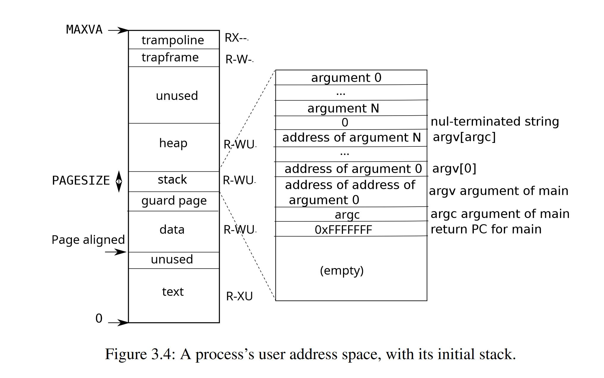

# Lab: mmap ([hard](https://pdos.csail.mit.edu/6.828/2022/labs/guidance.html))

> The `mmap` and `munmap` system calls allow UNIX programs to exert detailed control over their address spaces. They can be used to share memory among processes, to map files into process address spaces, and as part of user-level page fault schemes such as the garbage-collection algorithms discussed in lecture. In this lab you'll add `mmap` and `munmap` to xv6, focusing on memory-mapped files.
>
> Fetch the xv6 source for the lab and check out the `mmap` branch:
>
> ```shell
> $ git fetch
> $ git checkout mmap
> $ make clean
> ```
>
> The manual page (run `man 2 mmap`) shows this declaration for `mmap`:
>
> ```c
> void *mmap(void *addr, size_t length, int prot, int flags,
>            int fd, off_t offset);
> ```
>
> `mmap` can be called in many ways, but this lab requires only a subset of its features relevant to memory-mapping a file. You can assume that `addr` will always be zero, meaning that the kernel should decide the virtual address at which to map the file. `mmap` returns that address, or 0xffffffffffffffff if it fails. `length` is the number of bytes to map; it might not be the same as the file's length. `prot` indicates whether the memory should be mapped readable, writeable, and/or executable; you can assume that `prot` is `PROT_READ` or `PROT_WRITE` or both. `flags` will be either `MAP_SHARED`, meaning that modifications to the mapped memory should be written back to the file, or `MAP_PRIVATE`, meaning that they should not. You don't have to implement any other bits in `flags`. `fd` is the open file descriptor of the file to map. You can assume `offset` is zero (it's the starting point in the file at which to map).
>
> It's OK if processes that map the same `MAP_SHARED` file do **not** share physical pages.
>
> `munmap(addr, length)` should remove mmap mappings in the indicated address range. If the process has modified the memory and has it mapped `MAP_SHARED`, the modifications should first be written to the file. An `munmap` call might cover only a portion of an mmap-ed region, but you can assume that it will either unmap at the start, or at the end, or the whole region (but not punch a hole in the middle of a region).
>
> > You should implement enough `mmap` and `munmap` functionality to make the `mmaptest` test program work. If `mmaptest` doesn't use a `mmap` feature, you don't need to implement that feature.
>
> When you're done, you should see this output:
>
> ```shell
> $ mmaptest
> mmap_test starting
> test mmap f
> test mmap f: OK
> test mmap private
> test mmap private: OK
> test mmap read-only
> test mmap read-only: OK
> test mmap read/write
> test mmap read/write: OK
> test mmap dirty
> test mmap dirty: OK
> test not-mapped unmap
> test not-mapped unmap: OK
> test mmap two files
> test mmap two files: OK
> mmap_test: ALL OK
> fork_test starting
> fork_test OK
> mmaptest: all tests succeeded
> $ usertests -q
> usertests starting
> ...
> ALL TESTS PASSED
> $ 
> ```
>
> Here are some hints:
>
> - Start by adding `_mmaptest` to `UPROGS`, and `mmap` and `munmap` system calls, in order to get `user/mmaptest.c` to compile. For now, just return errors from `mmap` and `munmap`. We defined `PROT_READ` etc for you in `kernel/fcntl.h`. Run `mmaptest`, which will fail at the first mmap call.
> - Fill in the page table lazily, in response to page faults. That is, `mmap` should not allocate physical memory or read the file. Instead, do that in page fault handling code in (or called by) `usertrap`, as in the lazy page allocation lab. The reason to be lazy is to ensure that `mmap` of a large file is fast, and that `mmap` of a file larger than physical memory is possible.
> - Keep track of what `mmap` has mapped for each process. Define a structure corresponding to the VMA (virtual memory area) described in Lecture 15, recording the address, length, permissions, file, etc. for a virtual memory range created by `mmap`. Since the xv6 kernel doesn't have a memory allocator in the kernel, it's OK to declare a fixed-size array of VMAs and allocate from that array as needed. A size of 16 should be sufficient.
> - Implement `mmap`: find an unused region in the process's address space in which to map the file, and add a VMA to the process's table of mapped regions. The VMA should contain a pointer to a `struct file` for the file being mapped; `mmap` should increase the file's reference count so that the structure doesn't disappear when the file is closed (hint: see `filedup`). Run `mmaptest`: the first `mmap` should succeed, but the first access to the mmap-ed memory will cause a page fault and kill `mmaptest`.
> - Add code to cause a page-fault in a mmap-ed region to allocate a page of physical memory, read 4096 bytes of the relevant file into that page, and map it into the user address space. Read the file with `readi`, which takes an offset argument at which to read in the file (but you will have to lock/unlock the inode passed to `readi`). Don't forget to set the permissions correctly on the page. Run `mmaptest`; it should get to the first `munmap`.
> - Implement `munmap`: find the VMA for the address range and unmap the specified pages (hint: use `uvmunmap`). If `munmap` removes all pages of a previous `mmap`, it should decrement the reference count of the corresponding `struct file`. If an unmapped page has been modified and the file is mapped `MAP_SHARED`, write the page back to the file. Look at `filewrite` for inspiration.
> - Ideally your implementation would only write back `MAP_SHARED` pages that the program actually modified. The dirty bit (`D`) in the RISC-V PTE indicates whether a page has been written. However, `mmaptest` does not check that non-dirty pages are not written back; thus you can get away with writing pages back without looking at `D` bits.
> - Modify `exit` to unmap the process's mapped regions as if `munmap` had been called. Run `mmaptest`; `mmap_test` should pass, but probably not `fork_test`.
> - Modify `fork` to ensure that the child has the same mapped regions as the parent. Don't forget to increment the reference count for a VMA's `struct file`. In the page fault handler of the child, it is OK to allocate a new physical page instead of sharing a page with the parent. The latter would be cooler, but it would require more implementation work. Run `mmaptest`; it should pass both `mmap_test` and `fork_test`.
>
> Run `usertests -q` to make sure everything still works.

## 准备工作

首先开启 `mmaptest` 的编译，准备好 `sys_mmap()` 和 `sys_munmap()` 系统调用的框架。

根据提示，xv6 缺少内核态的 malloc，因此类似 Linux 中的 VMA 数据结构就需要提前在数组中分配好，随后可以动态从数组中拿取需要的结构体。根据提示，16 个 VMA 结构体已经足够。一种最简单的方法就是每个进程的 PCB 中都放 16 个。或者也可以选择 PCB 中存放链表头，然后按需从全局 VMA 结构体数组中取一个挂在链表中。无论选择哪种，都需要注意进程分配与销毁时对 VMA 数组中项的处理（释放）。

在 `kernel/proc.h` 中建立 VMA 结构体的定义，包含如下成员变量：

- 映射目标地址
- 长度
- 权限
- flags
- 文件
- 偏移
- 是否已被使用

定义如下：

```c
struct vm_area {
  uint64 addr;
  int length;
  int prot;
  int flags;
  struct file* file;
  int offset;
  int used;
};
```

这里选择第一种 VMA 数据结构分配方式。进程 PCB 结构体定义于 `kernel/proc.h` 的 `struct proc`，在其中加上一条 `struct vm_area vma[NVMA]`。

在 `kernel/proc.c` 的 `freeproc()` 中添加对 `struct vm_area vma[NVMA]` 的释放：

```c
  for (int i = 0; i < NVMA; i++) {
    p->vma[i].used = 0;
  }
```

## `sys_mmap()` 实现

mmap 系统调用的第 4 个参数是一个文件描述符，可以使用 `argfd(int n, int *pfd, struct file **pf)` 函数来读取参数，它可以把文件描述符写入 pfd 指针中，同时将 `struct file *` 指针写入 pf 指针中，方便后续直接通过 `struct file *` 对文件的操作。

随后需要检查参数正确性。根据提示，假定传入的 `addr`、`offset`都是 0，`length` 不能小于 0.

随后检查 mmap 权限的合理性：不能以可读的权限映射一个不可读的文件；不能以可写的 `MAP_SHARED` 方式映射一个不可写的文件，因为 `MAP_SHARED` 方式映射文件要求对文件的修改写回到原始文件中。

随后遍历 VMA 数组，查找一个可用的 VMA 结构体。

随后查找一个可用的虚拟内存空间放置 mmap 的内容。根据 xv6 book 的 Figure 3.4，用户地址空间中是有一段 unused 空间，位于 heap 顶部到 trapframe 之间。注意 xv6 的 heap 和 stack 的位置与常见的布局相反，trapframe 和 trampoline 各占一页。



因此我们可以在 heap 顶到 trapframe 之间分配空闲地址空间用于 mmap 的映射。heap 的顶由 `sys_sbrk()` 控制，当前的顶部记录在 `struct proc -> sz` 中，这也是整个进程地址空间最高的有效虚拟地址。

根据 `sys_sbrk()` 和其调用的 `growproc()` 的代码可知，heap 的扩张是在当前 sz 指向的地址之上向上扩张若干页的可写虚地址空间，而收缩是在当前 sz 指向的地址向下收缩若干页的虚地址空间。

如果我们从 heap 顶部开始分配虚地址空间给 mmap，可能会妨碍 heap 的扩张与收缩。如果与 heap 共用 sz 的数据，在分配 heap 的时候不会出现问题，但是在收缩 heap 的时候可能会出现破坏 mmap 空间或者 uvmunmap 一个无效页（munmap 之后）的情况。

因此考虑从 trapframe 底部开始分配虚地址空间给 mmap。暂不考虑使用单独的变量记录 mmap 中最低的虚地址，而是直接遍历所有本进程的 VMA 找到最低的虚地址。并且由于虚地址空间足够大，不需要考虑空闲空间不够用的情况，因此直接从最低 mmap 虚地址往下分配新的 mmap 空间。

可以引入头文件 `memlayout.h` 以使用 `TRAPFRAME` 宏来确定最高可用于 mmap 的虚地址。

随后写入 mmap 的相关参数到 VMA 结构体中。

由于 mmap 也是对文件的一次访问，因此需要对文件的引用计数加上 1。根据提示，可以使用 `filedup(struct file *f)` 函数完成（因为涉及到文件表的锁，因此不要手动直接对 file 结构体做操作）。

最后返回 addr，告知用户进程 mmap 分配的虚地址空间的起始地址。

完整代码如下：

```c
uint64 sys_mmap(void) {
  uint64 addr;
  int length;
  int prot;
  int flags;
  int fd;
  struct file* file;
  int offset;
  uint64 err = 0xffffffffffffffff;
  struct proc* p=myproc();

  argaddr(0, &addr);
  argint(1, &length);
  argint(2, &prot);
  argint(3, &flags);
  if (argfd(4, &fd, &file) < 0)
    return err;
  argint(5, &offset);

  if (addr != 0 || offset != 0 || length < 0)
    return err;

  // check permission
  if (!file->writable && (prot & PROT_WRITE) && (flags & MAP_SHARED))
    return err;
  if (!file->readable && (prot & PROT_READ))
    return err;

  // find free VMA struct
  int vma_i = -1;
  for (int i = 0; i < NVMA; i++) {
    if (!p->vma[i].used) {
      vma_i = i;
      break;
    }
  }
  if (vma_i == -1)
    return err;

  // find lowest existing mmap addr
  addr = TRAPFRAME;
  for (int i = 0; i < NVMA; i++) {
    if (p->vma[i].used && p->vma[i].addr < addr) {
      addr = p->vma[i].addr;
    }
  }
  addr = PGROUNDDOWN(addr - length);
  if (addr < p->sz) // lower than the top of heap
    return err;

  p->vma[vma_i].used = 1;
  p->vma[vma_i].addr = addr;
  p->vma[vma_i].length = length;
  p->vma[vma_i].file=file;
  p->vma[vma_i].flags=flags;
  p->vma[vma_i].prot=prot;
  p->vma[vma_i].offset=offset;

  // add refcnt of the file
  filedup(file);

  return addr;
}
```

## 中断处理流程实现

完成对在 mmap 区域中发生读写页错误异常的中断处理流程。

首先在 `kernel/trap.c` 的 `usertrap()` 中为读写的页错误异常添加分支。读写页错误异常的中断号分别为 0xd 和 0xf.

```c
else if((which_dev = devintr()) != 0){
    // ok
} else if ((r_scause() == 0xd || r_scause() == 0xf) && !map_mmap()) {
// ok
} else {
```

这里可以通过 `map_mmap()` 函数的返回值来做是否为 mmap 区发生的异常、mmap 区的读写权限问题等判断，若出现这类问题，即 `map_mmap()` 失败，可以进入下一分支，输出错误并杀死进程。

`map_mmap()` 函数的处理如下：

1. 根据异常地址与各 VMA 的起始地址、长度和偏移查找相关 VMA
2. 检查权限
3. 分配一页物理内存，清零（因为会有文件内容不足页的情况，`readi()` 并不会对这部分内存清零）
4. 使用 `mappages()` 建立虚拟页到物理页的映射。此时需要对 err_addr 向下对齐到页。
5. 使用 `readi()` 读取文件到物理内存，目标地址和偏移都需要相对 err_addr 向下对齐到页。注意操作前后需要对 inode 做加锁和解锁操作。

完成代码如下：

```c
int map_mmap() {
  struct proc *p = myproc();
  uint64 err_addr = r_stval();

  // find relative VMA
  int vma_i = -1;
  for (int i = 0; i < NVMA; i++) {
    if (p->vma[i].addr <= err_addr &&
        p->vma[i].addr + p->vma[i].length > err_addr) {
      vma_i = i;
      break;
    }
  }
  if (vma_i == -1) // not found
    return -1;

  // check permission & set prot flag
  uint64 flag = 0;
  if (p->vma[vma_i].prot & PROT_READ)
    flag |= PTE_R;
  else if (r_scause() == 0xd)
    return -1;
  if (p->vma[vma_i].prot & PROT_WRITE)
    flag |= PTE_W;
  else if (r_scause() == 0xf)
    return -1;

  // alloc phy mem
  void *mem = kalloc();
  if (!mem) {
    return -1;
  }
  memset(mem, 0, PGSIZE);

  // map new page
  if (mappages(p->pagetable, PGROUNDDOWN(err_addr), PGSIZE, (uint64)mem,
               flag | PTE_U) != 0) {
    kfree(mem);
    return -1;
  }

  // load file
  ilock(p->vma[vma_i].file->ip);
  if (readi(p->vma[vma_i].file->ip, 1, PGROUNDDOWN(err_addr),
            PGROUNDDOWN(err_addr) - p->vma[vma_i].addr + p->vma[vma_i].offset,
            PGSIZE) == -1) {
    iunlock(p->vma[vma_i].file->ip);
    return -1;
  }
  iunlock(p->vma[vma_i].file->ip);

  return 0;
}
```

运行 xv6 测试一下 mmaptest，在 munmap 处失败了，说明通过了 mmap 和页错误异常处理。

## `munmap()` 与 `sys_munmap()` 实现

现在来实现 `munmap()` 与 `sys_munmap()`。

这里先做一个假设，假设传入 `munmap()` 的地址是以页对齐的，长度都是页的整倍数，因为不对齐的话比较复杂，并且 mmaptest 中的样例也都是按页对齐的，所以可以过测而不会出问题。

此外，将取消 mmap 映射的主要功能逻辑部分单独提取出函数 `munmap()`，因为不只是 `sys_munmap()` 需要这段逻辑，进程退出时也需要这段逻辑。

`munmap()` 逻辑如下：

1. 首先遍历所有 VMA，确定输入的 addr 属于哪一段 VMA。
2. 随后对取消映射分三种情况：
   1. 从 VMA 的开头开始取消映射
      1. 更新 VMA 的 addr 和 offset
      2. 转到 3.
   2. 从 VMA 的尾部开始取消映射
      1. 转到 3.
   3. 从 VMA 的中间开始取消映射
      1. 不合法，失败返回
3. 更新 VMA 的 length
4. 检测 VMA 的 flag 是否为 MAP_SHARED，若是，则使用 `filewrite()` 对文件进行写回。
   - 根据 hint，这里可以使用 PTE 的 D(irty) 位来判断内存中的映射是否有被修改（为脏页），如果有，需要写回。但是由于测试中没有脏页写回优化的相关测试，因此可以直接把整个 unmap 区域的内容写回文件，降低难度。
5. 使用 `uvmunmap()` 取消页表映射。
   - 这里需要注意 `uvmunmap()` 不能取消未映射页的映射，会产生 panic，因此需要从 `uvmunmap()` 中提取部分代码，提前检测页是否未映射。
6. 通过 VMA 的剩余长度判断是否需要使用 `fileclose()`释放文件和当前 VMA。

`sys_munmap()` 主要内容就是调用 `munmap()` 函数。

完整代码如下：

```c
int munmap(uint64 addr, int length) {
  struct proc *p = myproc();

  // find relative VMA
  int vma_i = -1;
  for (int i = 0; i < NVMA; i++) {
    if (p->vma[i].addr <= addr && p->vma[i].addr + p->vma[i].length > addr) {
      vma_i = i;
      break;
    }
  }
  if (vma_i == -1) // not found
    return -1;

  // unmap virtual page
  pte_t *pte;
  if (addr == p->vma[vma_i].addr + p->vma[vma_i].offset) {
    // munmap from beginning
    p->vma[vma_i].addr += length;
    p->vma[vma_i].offset += length;
  } else if (addr + length == p->vma[vma_i].addr + p->vma[vma_i].length) {
    // munmap from end
    // jump out of if
  } else {
    return -1;
  }

  p->vma[vma_i].length -= length;

  // write back
  if (p->vma[vma_i].flags == MAP_SHARED) {
    filewrite(p->vma[vma_i].file, addr, length);
  }

  // unmap pagetable
  for (uint64 va = addr; va < addr + length; va += PGSIZE) {
    if ((pte = walk(p->pagetable, va, 0)) == 0)
      panic("uvmunmap: walk");
    if ((*pte & PTE_V) == 0)
      continue;
    uvmunmap(p->pagetable, va, 1, 1);
  }

  // release file & VMA
  if (p->vma[vma_i].length <= 0) {
    fileclose(p->vma[vma_i].file);
    p->vma[vma_i].used = 0;
  }

  return 0;
}

uint64 sys_munmap(void) {
  uint64 addr;
  int length;
  argaddr(0, &addr);
  argint(1, &length);

  return munmap(addr, length);
}
```

## 进程 fork 与 exit 处理

剩下需要处理的是 fork 时子进程对 mmap 的继承以及 exit 时对 mmap 和占用文件的释放。

`fork()` 中只需要将 PCB 中的 vma 数组拷贝一份到子进程，并且对引用的文件的引用计数加 1 即可，代码如下：

```c
// copy VMAs
memmove(np->vma, p->vma, sizeof(p->vma));
for (int i = 0; i < NVMA; i++) {
  if (p->vma[i].used) {
    filedup(p->vma[i].file);
  }
}
```

`exit()` 中只需要遍历 VMA，调用 `munmap()` 释放所有 used VMA：

```c
for (int i = 0; i < NVMA; i++) {
  if (p->vma[i].used) {
    munmap(p->vma[i].addr, p->vma[i].length);
  }
}
```

本实验做得比较糊弄，有些能优化的部分没有优化。能过就好，能过就好。
